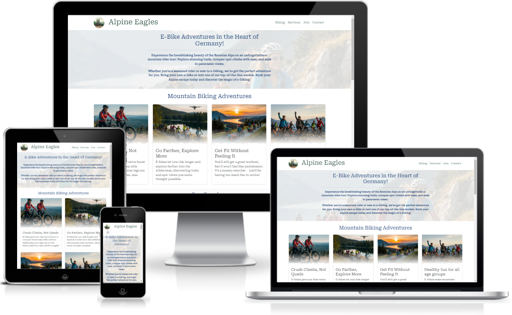
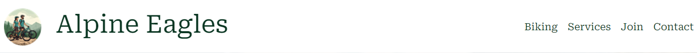
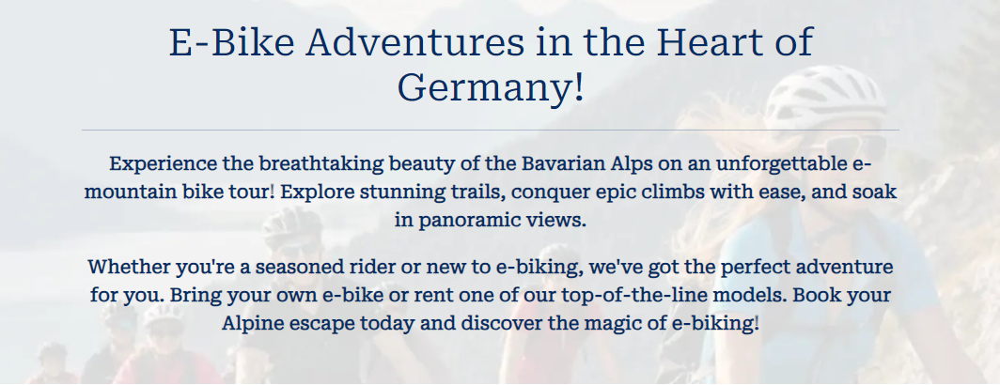
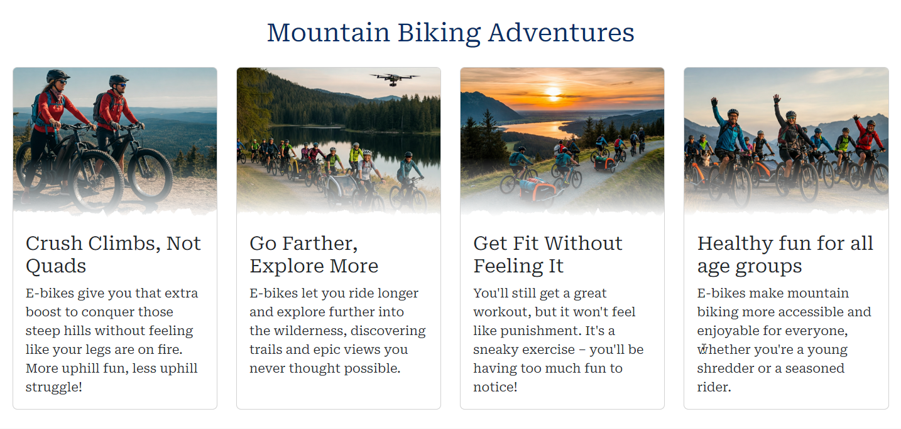
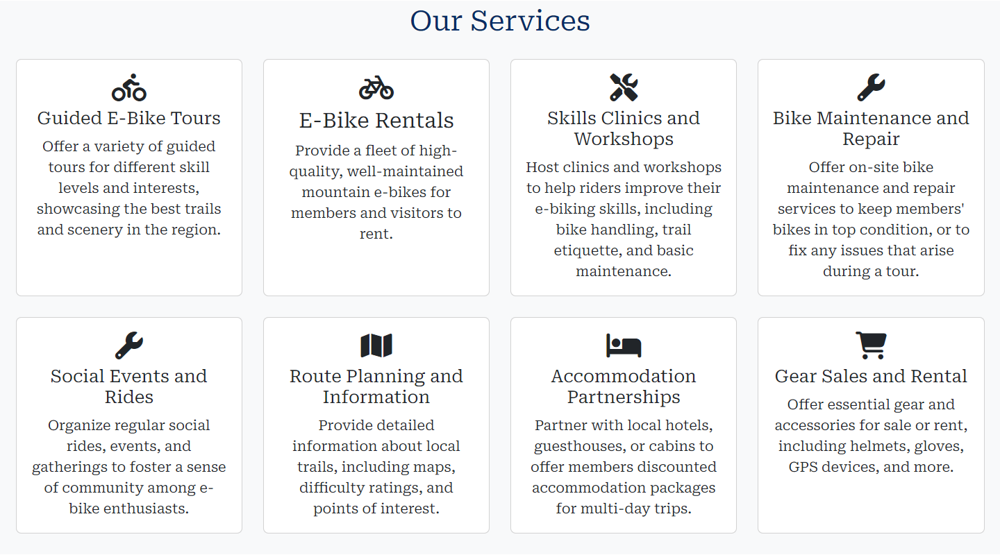
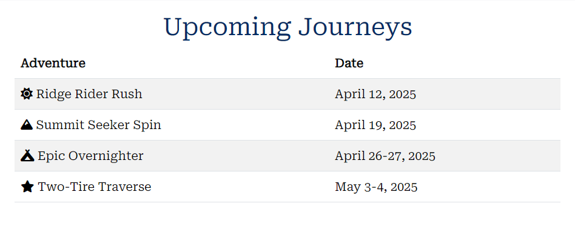
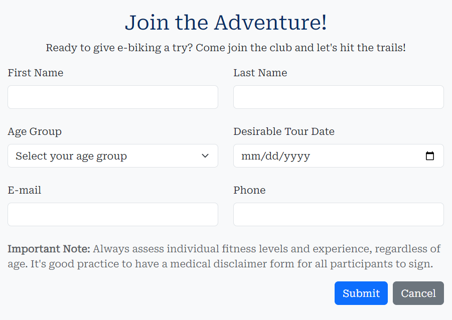
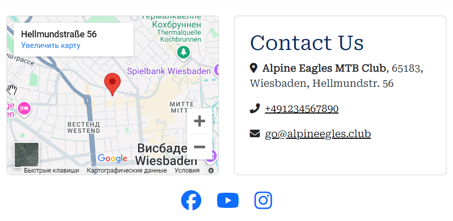
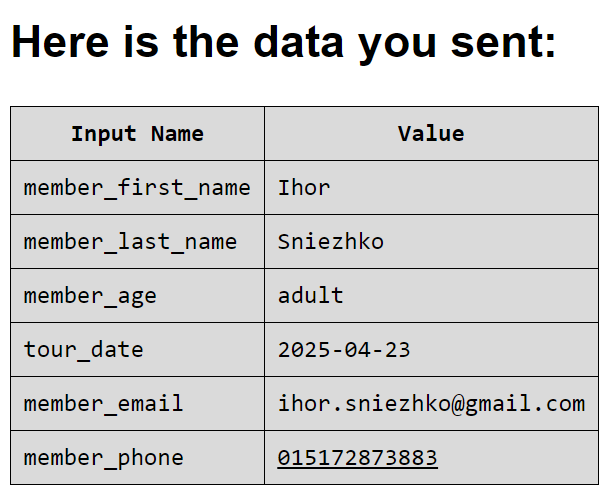

# Alpine Eagles E-bike MTB Club

This `README.md` provides an overview of the Alpine Eagles E-bike MTB Club website, its features, testing, deployment, and credits. This document will allow assessors, collaborators, and potential clients to understand the project and how to use it.

## Project Overview

The Alpine Eagles E-bike MTB Club website promotes e-mountain bike tours in the Bavarian Alps. It targets both experienced and new e-bikers interested in exploring the region's trails. The site provides information about the club, its services, scheduled tours, and a way to join the community. The goal of this project is to attract new members to the club by showing them the beauty of e-biking in the Bavarian Alps.

### Site Goals
*   Create an engaging and informative website that promotes the benefits of e-biking in the Bavarian Alps.
*   Attract new members to the Alpine Eagles E-bike MTB Club.
*   Provide easy access to information about tours, services, and how to join the club.

### Design Choices
*   The website uses a clean and responsive layout to ensure readability on all screen sizes.
*   High-quality images are used to enhance the visual appeal and highlight the natural beauty of the locations.
*   Clear and consistent navigation is used to improve user experience.
*   The website design leverages the default **Bootstrap 5 Light theme** and **Google Roboto Serif font**. This choice creates a clean, bright, and approachable aesthetic that aligns well with the outdoor adventure theme.

### User Stories
*   As a potential member, I want to easily find information about the club's services and tours.
*   As a new user, I want to be able to quickly navigate the website and find what I need.
*   As an interested rider, I want to see the schedule of upcoming tours and their dates.
*   As a user, I want to have access to the club's contact information.

## Balsamiq Wireframes

Balsamiq wireframes are low-fidelity, hand-drawn style digital sketches of the Alpine Eagles website's layout used to plan the user interface. Balsamiq was chosen for its ability to quickly create and iterate on visual layouts, allowing for rapid design decisions and modifications.

### Location
*	The wireframes PDF file for the Alpine Eagles website can be found [here](assets/media/alpine-eagles-wireframes.pdf).
*	The Balsamiq wireframes BMPR file can be found [here](assets/media/alpine-eagles-wireframes.bmpr).

### Wireframes for Alpine Eagles
*   Clear navigation menu is located at the top of the page, providing easy access to different sections of the website, including "Biking," "Services," "Schedule," "Join," and "Contact". The navigation bar collapses on smaller screens to maintain the site's integrity.
*   The wireframes include the club logo, and sections: "The main club offer", "Club Benefits", "Club services", "Journey Schedule", "Journey Check-in" and "Contacts".
*   A semitransparent Hero image and Club Offer are placed at the top of the landing page to engage visitors.
*   "Club Benefits" section describes the benefits of bicycle trips. Each benefit is illustrated with a spectacular picture.
*   "Club Services" describes the club's 8 most popular services, each visualized with a relevant icon.
*   "Journey Schedule" table show the upcoming trips with dates and descriptions.
*   A form is present to collect user information for joining the journey, including fields for First Name, Last Name, Age Group, Desirable Tour Date, E-mail, and Phone. The form includes a "Submit" and "Cancel" button.
*   The footer contains contact information, including the club's address, phone number, email, and social media links, like Facebook, Youtube, and Instagram.

## Site Features

### Existing Features

*   **Navigation Bar:** The navigation bar at the top of the page provides links to different sections: Biking, Services, Schedule, Join, and Contact. This allows easy navigation across all devices.

*  **Hero Section**: Includes a title, tagline and a brief explanation of the club's offering. The section's aim is to grab the user's attention and clearly explain the club's goals.

*   **Mountain Biking Adventures Section:** This section features four images and descriptive text, highlighting the benefits of e-biking. This section is designed to persuade users to join the club and consider e-biking as their form of exercise.

*   **Our Services Section:** This section lists the services offered by the club, including guided tours, rentals, and maintenance. This is valuable for users as they can learn about everything the club offers.

*   **Upcoming Journeys Section:** A table that shows upcoming tours with their dates. This allows users to see the tour schedule and plan accordingly.

*   **Join the Adventure Section:** This section has a sign-up form to allow users to join the club by providing their name, age, and contact information. The form includes client-side validation.

*   **Contact Us Section:** This section provides the club's contact information and social media links. Social media links open in a new tab.

### Future Features
*   A gallery section featuring images from past club events would be added to showcase the club's activities.
*   User login system and member profiles with different access levels.
*   More robust booking system for scheduled tours, and a calendar view.
*   Feedback or comment section for members to share their experiences.

## Testing

### Manual Testing
*   **Navigation Bar:** Tested on various devices to ensure responsiveness and proper link functionality. The navigation bar works as intended.
*   **Hero Section**: Tested to ensure it is visually appealing and clearly conveys the club's message.
*   **Mountain Biking Adventures Section:** Images and text are properly aligned and displayed correctly on all screen sizes.
*   **Our Services Section:**  The information about the services is easy to read and understand.
*   **Upcoming Journeys Section**: The table is formatted correctly.
*   **Contact Us Section:** Contact information and social media links work correctly.

### Manual Form Testing
*   **Join the Adventure Section:** The form is validated, and all fields can be filled. The form data is successfully sent to the server.

 

### Validator Testing
*   HTML: No errors were returned when passing through the [official W3C validator](https://validator.w3.org/nu/?doc=https%3A%2F%2Fihorsniezhko.github.io%2Falpine-eagles%2F).
*   CSS: No errors were found when passing through the [official (Jigsaw) validator](https://jigsaw.w3.org/css-validator/validator?uri=https%3A%2F%2Fihorsniezhko.github.io%2Falpine-eagles%2F&profile=css3svg&usermedium=all&warning=1&vextwarning=&lang=en).

## Credits

### Content
*   The text used in the "E-Bike Adventures in the Heart of Germany!" section was written by the project creator, based on information from similar sites.
*   The text in the "Mountain Biking Adventures" section was written by the project creator, based on information from similar sites.

### Media
*   The images used in the icon, site Logo, "Hero" and "Mountain Biking Adventures" sections are created with [Google Gemini ImageGen3](https://deepmind.google/technologies/imagen-3/).
*   The images edited with [ThechSmith Snagit Editor](https://www.techsmith.com/snagit/).
*   The social media icons in the Services section and the footer are from [Font Awesome](https://fontawesome.com/).